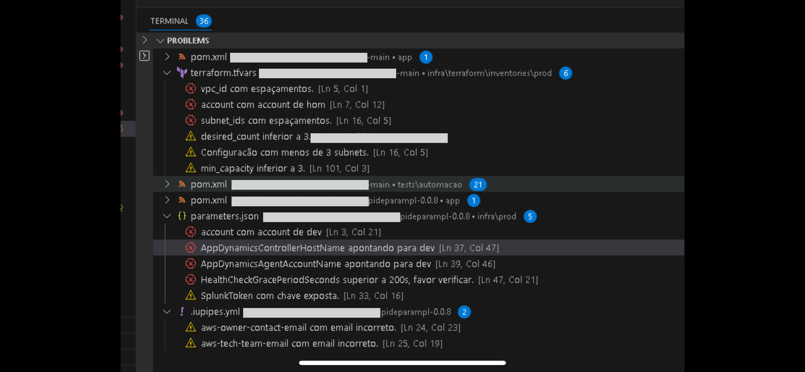

# README

Geração de diagnósticos seguindo as recomendações do Tech Enablers.

Essa extensão contempla as seguintes verificações nos templates de ECS.

- Variáveis apontando para recursos de dev ou hom;
- Espaços em branco nas variáveis de subnets e vpc;
- Se está configurada nas 3 AZs;
- Chave expostas;
- Apontamento para contas de homologação e desenvolvimento;
- Configuração de JVM;
- Email no .iupipes.yml;
- Retention Logs;
- Desired, Min Tasks e Max Tasks;
- Grace Period;
- Cooldown.

Arquivos validados:

- Parametrização de produção (Terraform | CloudFormation)
- Dockerfile
- .iupipes.yml

